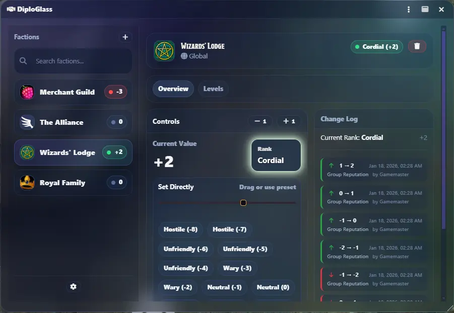
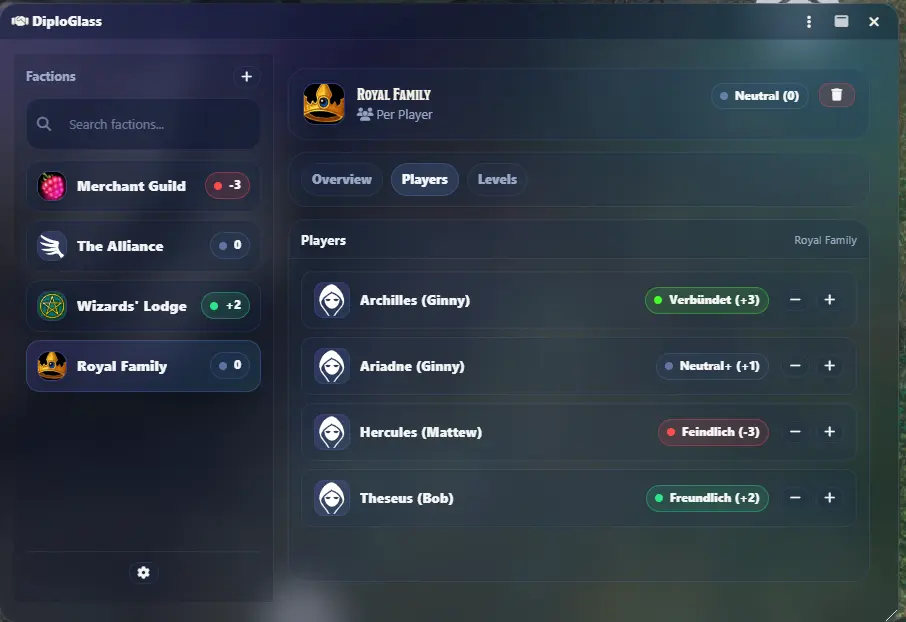
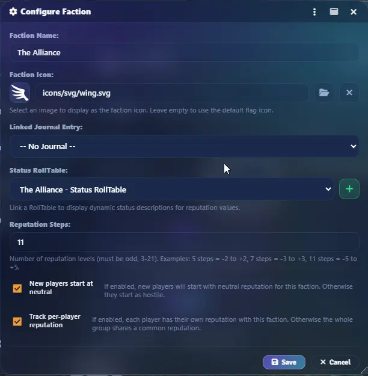

# DiploGlass

Weave intricate diplomatic relationships in your campaigns. Track reputation, alliances, and faction standing with elegant tools designed for political intrigue and social dynamics.

## Features

- **Faction Management**: Create and manage factions with custom icons, linked journal entries, and configurable reputation scales
- **Flexible Reputation Tracking**: Choose between per-player or global (group) reputation modes for each faction
- **Customizable Reputation Levels**: Configure 3-21 reputation steps with custom labels and colors
- **RollTable Integration**: Link RollTables to display dynamic status descriptions
- **Change Log**: Track all reputation changes with timestamps and comments
- **Chat Integration**: Optional chat messages when reputation changes
- **Player Access Control**: Configure whether players can view or even edit reputations

## Screenshots

*Faction overview with reputation tracking*

*Per-player reputation mode for individual tracking*

*Flexible configuration options*

## Installation

1. In Foundry VTT, go to **Add-on Modules**
2. Click **Install Module**
3. Paste the manifest URL: `https://raw.githubusercontent.com/munichjake/diploglass/main/module.json`
4. Click **Install**

## Usage

1. Enable the module in your world's module settings
2. Click the handshake icon in the token controls or the "Reputation" button in the player list
3. Add factions and configure their reputation settings
4. Track and modify reputation values for players or the group

## Compatibility

- **Minimum**: Foundry VTT v12.0.0
- **Verified**: Foundry VTT v13.347
- **Maximum**: Foundry VTT v13.x

## Supported Languages

German, English, French, Italian, Spanish, Japanese, Korean, Turkish, Polish, Hungarian, Danish, Swedish, Finnish

## AI Disclosure

This module was developed with assistance from AI tools (Claude) for translations and to accelerate testing.

## Contributing

Contributions are welcome! Feel free to open issues for bug reports or feature requests, or submit pull requests with improvements.

## License

GPL-3.0 - Free to use, modify, and distribute. Derivative works must also be open source under GPL. See [LICENSE](https://www.gnu.org/licenses/gpl-3.0.html) for details.

## Author

[munichjake](https://github.com/munichjake)

## Links

- [Report Issues](https://github.com/munichjake/diploglass/issues)
- [Changelog](https://github.com/munichjake/diploglass/blob/main/CHANGELOG.md)
